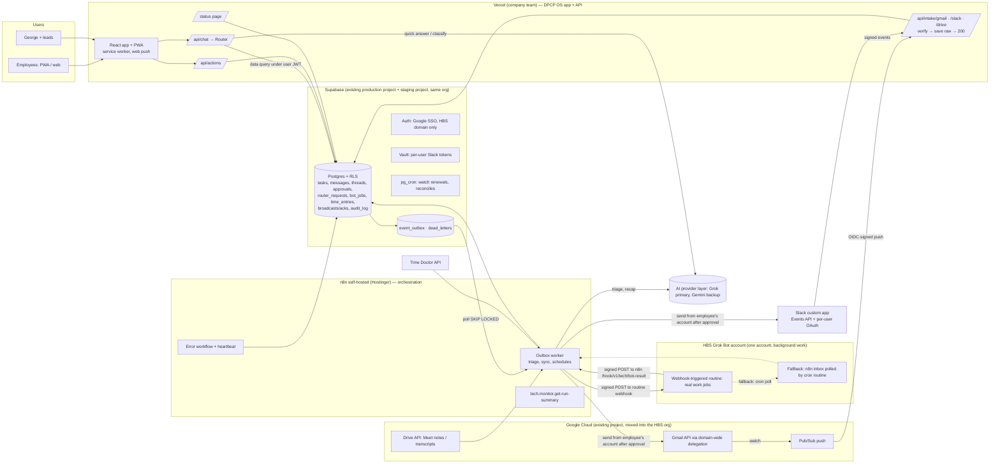

# DPCP OS technical design v1 (DRAFT)
> **Preamble: built from first principles (George, Oct 3).** DPCP OS is designed from what the company needs: one system of record, humans doing human work, AI doing the rest, and reliability first. **Past work is optional reference material, not the foundation.** That includes the Time Doctor V2 workflow design, Aqib's existing n8n flows, the Airtable pipeline, the legacy app and earlier briefs. Where a past design is reused, it is because it passes the same review as new work, not because it already exists. Old flows keep running only so nothing stops (for example George's daily Time Doctor report) until their DPCP OS replacement passes parity.
> **Also Oct 3:** Time Doctor stays core as a **controllable** data source, with full read and write control of TD and n8n from Grok Bot and Cursor behind George's approval gate (§7, §7b; access-spec.md §0a). The **first 8 Copilots** are the department modules (§16). A no-login **practice staff site** serves HDG practices first and clients identically (§17). **Cursor Teams** is the shared repo home (access-spec.md §2a).
Prepared Sat Oct 3, 2026 (AZ, UTC-7) by Technology & DPCP OS Architect Bot. **Draft only:** nothing built, logged into, sent or posted; no secret values. **No dates or timelines.** The only date in this program is the n8n Cloud cancel deadline, **Wed Oct 21** (foundation-checklist.md).
**Update (Sat Oct 3, 11:36 AM AZ):** bot-work transport is now a webhook-triggered routine on the HBS Grok Bot account (§4 C, V1), with inbox polling as the fallback. Issue files are in `issues/`; decisions in `decision-brief.md`.
**Labels:** [SOURCE] cited · [INFERENCE] my reading · [ASSUMPTION] default George can change · [ESTIMATE] rough cost · **[VERIFY]** must pass the test in §13 before anyone builds on it.
**Builds on (contracts and decisions):** integration-contract.md (CONTRACT), mvp-data-model.md (MODEL), foundation-checklist.md v0.4 (FOUND; accounts transferred to George in place, no new accounts), first-issue.md, dpcp-os-status.md (STATUS), td-v2-bot-takeover.md (TDBOT), time-doctor/ (TD briefs F0C587LADE3 and F0C5XFJ3479), /workspace/org-design/program/ (ROAD, AQIB, HBS, NEWACCT). TDBOT, the `time-doctor/` briefs and the existing flows are **reference only** (preamble).
**George's brainstorm decisions (Oct 3, relayed by CoS)** are the requirements; each section notes where it implements one. Where they change earlier docs: (1) **one HBS Grok Bot account does background work and employees are app users only**, which supersedes the per-employee bots and bot side panel in HBS §4.3 and ROAD 2.1/4.1; (2) ~~**xAI replaces Gemini**~~ superseded, see below.
**George's newer decisions (relayed by CoS; supersede earlier text in this doc):**
- **Time Doctor** is a core platform on its **highest tier** for everyone (§7; `time-doctor-data-flow.md`).
- **n8n** (self-hosted) is the core orchestration layer, and bots get **n8n API build access** (staging, one key per bot, audited; FOUND 1.5b).
- AI is **model-agnostic** behind a provider layer: **Grok primary, Gemini backup** (Gemini kept, via Vertex AI under george@).
- There is **no AI spend cap**. A per-user **usage-versus-output** report replaces it (§5, §10).
- **Two mandatory daily check-ins**, with an AI voice call for anyone who misses the meeting.
- **RCM is the only part with PHI.**
- A **three-stage rollout** (§15), where **nothing is blocked at switchover**.

---

## 1. Architecture

**Key rule [design]:** intake endpoints run on Vercel (managed, autoscaling) and only **verify, save raw, return 2xx**. All processing happens later from the outbox. So an n8n, xAI or Grok Bot outage never loses an inbound message; it only delays triage.

## 2. Components
| Component | Runs on | Does | Doesn't |
|---|---|---|---|
| DPCP OS app + PWA | Vercel Pro (company team) | Login, My Next Task, threads/inbox, approvals, broadcasts, dashboards, chat box, status page; installable PWA with web push | Hold service keys in the browser |
| API routes | Vercel server functions | `/api/chat` (router), `/api/actions` (app actions), `/api/intake/*` (Gmail push, Slack events), `/api/hooks/v1/*` (HMAC callbacks) | Long jobs (anything > the inline budget goes async) |
| Router | `/api/chat` | Decides per request (§5); logs usage (no spend cap); writes `router_requests` | Run raw SQL from the model; send anything outbound |
| System of record | Supabase Postgres (+ Auth, Storage, Vault, pg_cron) | All durable state, RLS, outbox, audit | Business logic hidden in n8n |
| Orchestrator | n8n self-hosted, prod + staging | Outbox worker, triage, syncs (TD, Drive), schedules, sends after approval, Grok Bot wake, error workflow, heartbeat | Be the record; hold state that matters |
| Background worker | **One HBS Grok Bot account** | Real work (drafts, research, multi-step jobs) triggered per `bot_jobs` row; posts results back to the task | Talk to employees directly; hold DB keys; send outbound |
| LLM | **Provider layer:** xAI API (Grok, primary) and Google Gemini via Vertex AI (backup), one adapter, models in config, automatic logged fallback | Quick answers, classification, triage, recaps, TD descriptions, check-in and morning-feedback text | See PHI; compute times or totals (code does that, George's TD decision) |
| Comms | Gmail (DWD + Pub/Sub), Slack custom app, Drive (Meet/Gemini notes) | Intake; replies from the employee's own account | — |
| Time | Time Doctor API | Worklogs, activity/idle, screenshots for TD reports | — |
| Monitoring | n8n heartbeat + `job_runs`, external uptime check, `/status` | Alerts on silence or failure; public health page | Count on n8n to monitor n8n alone |
| Control gateway (Oct 3) | Vercel server route `/api/control/v1/*` | Holds production n8n keys and the TD token server-side; records proposals; applies George-approved changes; keeps prior versions; read routes for executions and logs (§7b) | Apply anything that needs approval without it; hand a key to a caller |
| Practice staff site (Oct 3) | Same Vercel app, `/p/<practice>` + `/api/practice/v1/*` | No-login checklists, issues, support requests, feedback and tasks on enrolled practice devices (§17) | Show PHI; show another practice's names; work on an unenrolled device |

## 3. Data model additions (extends MODEL; same conventions: uuid PK, timestamptz UTC, `data_class` check without `phi`, RLS on, no default access)
Helper functions from MODEL §4: `current_employee_id()`, `is_supervisor_of(emp)`, `is_admin()`.

**threads** — one conversation (email thread, Slack channel/thread, DM, chat session, meeting).
`id` · `org_id` fk · `source` check in ('gmail','slack','chat','meet','app') · `external_id` text (Gmail threadId / Slack `team:channel[:thread_ts]` / Drive file id) · `owner_id` fk employees null (mailbox owner or DM participant who connected) · `participants` jsonb (ids/emails, no bodies) · `subject` text · `task_id` fk tasks null · `last_message_at` · `data_class` · `created_at`. **Unique** (`source`,`external_id`,`owner_id`). Index (`owner_id`,`last_message_at desc`).
RLS: select where `owner_id = current_employee_id()` **or** the user is in `participants` for channel threads they belong to; admin per decision D3 (every admin read writes `audit_log`). Insert/update: service role only.

**messages** — every inbound/outbound message, saved **before** processing.
`id` · `thread_id` fk · `source` · `external_id` text (Gmail messageId / Slack `channel:ts` / Drive revision) · `idempotency_key` text **unique** (`gmail:<user>:<msgId>`, `slack:<team>:<channel>:<ts>`, `drive:<fileId>:<revisionId>`) · `direction` check in ('inbound','outbound') · `sender` text · `recipients` jsonb · `sent_at` · `body_text` text · `body_ref` text (Storage path for large/raw MIME) · `attachments` jsonb (names, sizes, storage paths) · `status` check in ('received','triaged','tasked','ignored','held','needs_attention') · `triage` jsonb (labels, confidence, model, cost) · `phi_screen` check in ('pass','held','skipped') · `data_class` · `received_at` default now().
Indexes: (`thread_id`,`sent_at`), (`status`) where status in ('received','needs_attention'), GIN FTS on `body_text`.
RLS: same visibility as the thread. Insert: service role only (intake). Outbound rows written by the sender flow.

**router_requests** — every chat-box request.
`id` · `employee_id` fk · `thread_id` fk (chat session) · `text` · `route` check in ('quick_answer','knowledge','data_query','app_action','bot_work','decision','clarify') · `confidence` numeric · `status` check in ('inline_done','async_queued','clarifying','failed','over_budget' — deprecated, never written under the no-cap decision) · `model` text · `fallback_used` bool · `tokens_in`/`tokens_out` int · `cost_usd` numeric(10,5) · `latency_ms` int · `task_id` fk null · `bot_job_id` fk null · `approval_id` fk null · `created_at`.
Index (`employee_id`,`created_at desc`); daily cost view per employee. RLS: own rows; admin all; supervisor none (prompt text is private) [ASSUMPTION].

**bot_jobs** — work handed to the HBS Grok Bot.
`id` · `task_id` fk not null (results always land on a task) · `requested_by` fk employees · `kind` text (e.g. 'draft_reply','research','summarize_thread') · `input_ref` jsonb (IDs only, no bodies) · `status` check in ('queued','sent','running','succeeded','failed','needs_attention','cancelled') · `attempt` int · `idempotency_key` **unique** (`bot:<task_id>:<kind>:<n>`) · `sent_at`, `started_at`, `finished_at` · `result_ref` text (comment/attachment id on the task) · `error_code` · `cost_estimate_usd` · `deadline_at` (timeout → retry/needs_attention) · `transport` check in ('webhook','inbox_poll') default 'webhook'.
Index (`status`,`sent_at`). RLS: select if the task is visible; writes service role only.

**broadcasts** + **acknowledgements** — must-acknowledge announcements.
broadcasts: `id` · `author_id` · `title` · `body` · `audience` jsonb (all / departments / employee ids) · `requires_ack` bool · `ack_due_at` · `published_at` · `status` ('draft','published','closed').
acknowledgements: `id` · `broadcast_id` fk · `employee_id` fk · `delivered_at` · `seen_at` · `acknowledged_at` · `channel` ('app','push','email','slack') · `reminders_sent` int. **Unique** (`broadcast_id`,`employee_id`). Index (`broadcast_id`) where `acknowledged_at is null`.
RLS: employee selects/updates **own** row (only `seen_at`/`acknowledged_at`, via RPC `ack_broadcast`); author/supervisor select rows for their audience; admin all.

**feedback_tickets** — "report a problem / idea" from any screen.
`id` · `reporter_id` · `screen` text · `kind` ('bug','idea','question') · `description` · `context` jsonb (route, app version, request id; no message bodies) · `status` ('new','triaged','in_progress','done','wontfix') · `assignee` text (Aqib for quick fixes in #automation-team; product bot for build issues) · `github_issue_url` null · `created_at`. RLS: reporter sees own; admin/Aqib all.

**time_entries** — Time Doctor data, normalized (designed from first principles; TD V2 is reference only, §7).
`id` · `employee_id` fk · `td_user_id` text · `work_date` date (shift-based day, George's TD decision) · `kind` check in ('worklog','idle_incident','break','manual') · `started_at`, `ended_at` · `minutes` numeric **generated** (ended−started) stored · `task_id` fk null (mapped DPCP task) · `td_task_ref`/`td_project_ref` text · `activity_pct` numeric null · `source_ref` text · `idempotency_key` **unique** (`td:<td_user_id>:<worklog_id|start_ts>:<kind>`) · `description` text (LLM, descriptions only) · `checks` jsonb (pre-send gate results) · `archived_at`.
Checks: `ended_at > started_at`; `minutes <= 1440`. Index (`employee_id`,`work_date`). RLS: employee own; supervisor team; admin all.

**Support tables:** `mailbox_cursors` (employee_id, provider, last_history_id, watch_expires_at, last_full_sync_at) · `connected_accounts` (employee_id, provider, scopes, vault_secret_id, status, connected_at) · `sop_documents` (id, title, body, source_ref, tsvector) for knowledge retrieval · `app_flags` (key, enabled) kill switches. All service-role or admin only, except `sop_documents` select for authenticated.

## 4. Event and webhook contracts (extends CONTRACT §2–§5; envelope `dpcp.event` v1.0 unchanged)
**New event types:** `message.received`, `message.triaged`, `message.held`, `thread.task_linked`, `router.request.completed`, `bot.job.requested`, `bot.job.completed`, `bot.job.failed`, `broadcast.published`, `broadcast.ack_overdue`, `ack.recorded`, `feedback.created`, `time.entries.imported`, `idle.incident.detected`, `meeting.notes.ingested`, `outbound.approved`, `outbound.sent`.

**A. Intake (external → Vercel), verified before saving**
- Gmail: Pub/Sub **push** with an OIDC token; verify the JWT signature, `aud` = our endpoint and `email` = the push service account [VERIFY V5]. Body carries `{emailAddress, historyId}` only; we store it, enqueue `gmail.history.sync`, return 204.
- Slack: verify `X-Slack-Signature` (v0 HMAC-SHA256 of `v0:<timestamp>:<raw body>` with the app signing secret) and reject timestamps > 300 s old; answer `url_verification`; save raw event; dedupe on `event_id`; return 200 within 3 s.
- Drive: polled by n8n (no inbound hook in v1) [ASSUMPTION; Drive push channels later].

**B. Normalized inbound message (saved row, also the `message.received` payload)**
```json
{ "message_id":"uuid","thread_id":"uuid","source":"gmail|slack|meet",
  "idempotency_key":"gmail:aqib@hariribusinessservices.com:18f2c...",
  "direction":"inbound","sender":"x@client.com","recipients":["..."],
  "sent_at":"<ISO-8601 UTC>","has_attachments":true,
  "owner_employee_id":"uuid","data_class":"internal" }
```
(Bodies stay in the DB; events carry IDs, per CONTRACT §2.)

**C. n8n → HBS Grok Bot (bot job wake), HMAC per CONTRACT §5**
**Transport [SOURCE: George via CoS, Sat Oct 3 11:36 AM AZ — Grok Bot routines support a webhook trigger type, alongside cron, Slack, GitHub, email and others]:** the bot-work route uses **one webhook-triggered routine on the HBS Grok Bot account** (`hbs.bot.job-worker`). n8n sends this envelope as a signed POST (CONTRACT §5 headers) to the routine's webhook URL; the routine checks the signature, timestamp skew and `event_id` before doing anything, does the work, and posts the result (D) back through the signed n8n endpoint `/hook/v1/tech/bot-result`. The webhook URL and the HMAC secrets are stored in n8n credentials and the bot account's secret store, never in this repo. **[VERIFY on HBS account — V1]:** how the routine's webhook authenticates callers (its own token, our HMAC checked inside the routine, or both), the largest payload it accepts, and that 10 events in 1 minute are each processed once (queued, not dropped or doubled). **Fallback (kept):** if V1 fails or the webhook is down, n8n leaves the job in an inbox (`GET /hook/v1/tech/inbox`, HMAC-signed) and a cron routine on the same account polls it; `bot_jobs.transport` records which path ran.
```json
{ "schema":"dpcp.event","schema_version":"1.0","event_type":"bot.job.requested",
  "event_id":"uuid","idempotency_key":"bot:<task_id>:draft_reply:1",
  "env":"production","occurred_at":"<ISO-8601 with offset>",
  "payload":{"bot_job_id":"uuid","task_id":"uuid","kind":"draft_reply",
             "instructions":"Draft a reply for the employee to review",
             "context_url":"https://<app>/api/hooks/v1/bot/context/<bot_job_id>",
             "deadline_s":900},
  "callback":{"url":"https://<n8n>/hook/v1/tech/bot-result","timeout_s":900},
  "trace":{"run_id":"uuid","attempt":1} }
```
The bot fetches context through a **short-lived, single-job signed URL** (HMAC over job id + expiry), so the wake payload never carries message bodies and the bot never holds a DB key.
**D. Grok Bot → n8n result callback**
```json
{ "event_type":"bot.job.completed|bot.job.failed","idempotency_key":"bot:<task_id>:draft_reply:1:result",
  "payload":{"bot_job_id":"uuid","status":"succeeded|failed","result":{"type":"draft","text":"..."},
             "reason_code":null,"cost_estimate_usd":0.04} }
```
n8n verifies HMAC, writes the result as a task comment/draft, sets `bot_jobs.status`. Drafts that would go outbound create an `approvals_queue` row; nothing is sent from the callback.
**E. Router request/response (`/api/chat`, user JWT)**
```json
// request
{ "session_id":"uuid","text":"What's overdue on my team?","client_request_id":"uuid" }
// response (inline)
{ "router_request_id":"uuid","route":"data_query","status":"inline_done",
  "answer":"3 items overdue...","citations":[{"type":"task","id":"uuid"}],
  "followups":["Reassign one?"] }
// response (async)
{ "router_request_id":"uuid","route":"bot_work","status":"async_queued","task_id":"uuid",
  "message":"Working on it — it'll appear on your task list." }
// response (clarify)
{ "route":"clarify","status":"clarifying","question":"Which client do you mean: A or B?","options":["A","B"] }
```
`client_request_id` is the idempotency key for retries from flaky mobile connections.
**Signing and idempotency summary:** HMAC-SHA256 on all our own hops (CONTRACT §5), vendor signatures on vendor hops (Slack signing secret, Pub/Sub OIDC), unique `idempotency_key` columns on `messages`, `bot_jobs`, `time_entries`, `processed_events`; duplicates return the original result.

## 5. Router design
**Order of decision (cheap and deterministic first):**
1. **Explicit intent** — button, slash command (`/task`, `/ask-bot`, `/sop`), or a form: route directly, no model call.
2. **Rules** — regex/keyword rules (e.g. "approve", "broadcast", a task ID) with high precision.
3. **Classifier** — xAI call with structured output `{route, confidence, entities, needs_clarification}`, using the small/cheap model [ASSUMPTION: a grok-4.3-class model; pricing per docs.x.ai/developers/pricing].
4. **Clarify** if confidence < 0.6 [ASSUMPTION], or entities are ambiguous (two clients match), or the action is outbound/irreversible and the target is unclear. Max 2 clarifying turns, then offer "create a task for a human".
5. **Usage logging (replaces the budget gate; no AI spend cap)**: no cost check blocks a model call. Every call records provider, model, tokens, cost and latency. The per-user usage-versus-output report and an optional soft anomaly alert (never blocking) use these rows (router/spec.md §5).
6. **Execution time budget** — if the route's expected time ≤ **30 s** run inline; otherwise (or on timeout) convert to async: create/attach a task and return `async_queued`.

**Routing table**
| Route | Trigger examples | Handler | Data access | Inline/async | Outbound? |
|---|---|---|---|---|---|
| quick_answer | "How do I word…", general question | Provider layer: **Grok primary; Gemini backup** on error/timeout/invalid output (D5 decided) | none beyond the prompt | inline | no |
| knowledge | "What's our SOP for…" | Postgres full-text search over `sop_documents` → xAI answers **only from retrieved text with citations**; no hit → say so | `sop_documents` (RLS) | inline | no |
| data_query | "What's overdue on my team?" | Model picks from a **fixed catalog of parameterized query tools** (`my_tasks`, `team_overdue`, `thread_search`, `my_time_today`…); the server runs them **with the user's JWT**, so RLS limits rows | user's own RLS scope | inline | no |
| app_action | "Create a task for Zaid due Friday", "mark done", "reassign" | Tool call → `/api/actions` with the user's JWT; destructive actions get a confirm step | RLS | inline | **If it sends anything outside DPCP OS (email, Slack, client) → `approvals_queue`**, never direct |
| bot_work | "Draft replies to these 5 emails", "research this vendor" | Create task + `bot_jobs` row → outbox → n8n → signed POST to the HBS **webhook-triggered routine** (§4 C) → bot posts back via signed n8n endpoint (§4 D) → result on the task; fallback: inbox poll | IDs only to the bot | async | drafts → approvals |
| decision | "Can we give the client a discount?", policy questions | `approvals_queue` kind `decision`, routed to George or the employee's lead by rule | — | async | no |
| clarify | low confidence / ambiguity | ask a question with options | — | inline | no |

**Guardrails:** the model never writes SQL; tools are allowlisted per role; every route writes `router_requests`; PHI screen (§8) runs before any AI provider call; responses cite task/SOP IDs; no answer is invented when a query returns nothing.
**Outbound rule [INFERENCE from George's "approval queue" + "replies from the employee's own account"]:** an employee clicking **Send** on their own reply is their own action and goes out immediately from their account; anything a bot or the router drafts goes to `approvals_queue` first (approver = the employee for their own replies; George/lead for client-facing or policy items, per George's standing email rules). D4 confirms.

## 6. Comms intake
**Rule (George):** every inbound message is **saved before it's processed**, then triaged into tasks; replies go out from the employee's own account.
**Source scope (D1 decided, George's D1 decision (Oct 3, 11:51 AM, relayed by CoS)):** core intake covers every HBS mailbox and Slack channel **except RCM/billing sources**. An `intake_exclusions` list (source, identifier, reason `rcm`) holds the RCM/billing mailboxes, Slack channels and Drive folders; George (or whoever he names) maintains it, and changes are audited. Excluded sources are **never watched, fetched or stored** in core: no Gmail watch, no Slack event subscription or backfill, no Drive polling. Mail or DMs from an RCM/billing person to a non-RCM employee arrive through that employee's mailbox and pass the PHI screen like anything else. The table shape is up to the db/ worker.
**Gmail — all non-RCM employees, Google Workspace domain-wide delegation (DWD) + Pub/Sub push**
1. One service account in the existing Google Cloud project once it's moved into the HBS org (FOUND 1.9), authorized in Admin console → Security → API controls → Domain-wide delegation for minimal scopes: `gmail.readonly` (intake), `gmail.send` (replies, only if D4 keeps app-sent replies), Drive read for Meet notes (§6 Meet) [VERIFY V4 for the narrowest Drive scope].
2. Per mailbox **not on `intake_exclusions`**: `users.watch` on topic `projects/<project-id>/topics/gmail-intake` (grant `gmail-api-push@system.gserviceaccount.com` publisher). Gmail requires renewal at least every 7 days; a pg_cron/n8n job renews **daily** and records `watch_expires_at` (Google Gmail push guide). 
3. Push → `/api/intake/gmail` (OIDC-verified) → store `{emailAddress, historyId}` → outbox `gmail.history.sync`.
4. n8n worker: `history.list` from `mailbox_cursors.last_history_id` → `messages.get` → upsert `threads`/`messages` (idempotency `gmail:<user>:<msgId>`) → advance cursor. If the history id is too old (404), run a bounded full sync.
5. **Reconciliation** every few hours [ASSUMPTION]: compare Gmail message ids since the cursor with stored rows; any gap is re-fetched. This is what makes "0 lost messages" checkable.
**Slack — one custom (internal) app, channels + DMs via per-user OAuth**
- Slack's free plan allows **up to 10 apps** and shows **90 days** of history; data older than one year is deleted (slack.com/help/articles/115002422943). George's note says the free plan allows **one app slot**; Slack's page says 10, so the real question is how many are already used [VERIFY V3: count installed apps]. Our DB copy becomes the record because Slack's own history expires.
- **Internal customer-built apps keep Tier 3 limits** on `conversations.history`/`replies` (50+ req/min, 1,000 objects); the 2025 cuts apply only to commercially distributed non-Marketplace apps (docs.slack.dev changelog 2025-05-29). So the app must stay **internal** to the HBS workspace.
- Bot token: channel events (`message.channels`, `message.groups` for private channels the app is in). User tokens (each employee clicks "Connect Slack"): `im:history`, `mpim:history` (+ `chat:write` user scope if replies go out as them) → events `message.im`, `message.mpim` (docs.slack.dev im:history / message.im). Tokens stored in Supabase Vault (`connected_accounts.vault_secret_id`).
- **Dedupe:** a DM between two connected employees arrives on both tokens; key `slack:<team>:<channel>:<ts>` stores it once, with both as participants.
- Backfill on connect: `conversations.history` for the visible 90 days. RCM/billing channels on `intake_exclusions` are skipped: the app isn't added to them, and events from them are dropped before storage. RCM/billing staff don't get the DM-connect prompt in core.
**Triage pipeline (n8n, from outbox)**
`received` → **PHI screen** (deterministic rules: patient/member/DOB/claim patterns, sender domain lists for payers/PMS; hits → `held`, never sent to xAI). Under D1 this is a **safety net**, not the main control: the main control is excluding RCM/billing sources. Any hit raises a needs-attention item so the source can be reviewed for exclusion. → **classify** (xAI small model: ignore / FYI / reply-needed / task / decision; extracts due date, client, owner) → actions: link to an existing thread task, create a task (owner = mailbox owner unless rules say otherwise, `original_due_at` proposed, owner confirms with one tap), or mark `ignored` (newsletters, notifications). Each employee still sees **one next task at a time** (ROAD 2.3 "My Next Task").
**Replies from the employee's account:** the reply composer in DPCP OS sends via Gmail API (impersonating the employee through DWD, threading headers kept [VERIFY V13]) or Slack `chat.postMessage` with that employee's user token. Bot-drafted replies go through `approvals_queue` first (§5).
**Google Meet + Gemini notes → recap + tasks:** n8n polls Drive (DWD; RCM/billing folders and meetings on `intake_exclusions` are skipped) for new "Notes by Gemini" docs and transcripts in organizers' Meet Recordings folders [VERIFY V8 for location and scope]; key `drive:<fileId>:<revisionId>`; xAI writes a short recap (posted to a `meet` thread) and proposed tasks with owners and due dates; owners confirm. This absorbs the daily-reports feed: the current unauthenticated n8n webhook and Netlify page are replaced by a DPCP OS page behind login (FOUND Q4 default).

## 6b. RCM add-on track (separate module; D1 decided)
**Decision (George's D1 decision (Oct 3, 11:51 AM, relayed by CoS)):** RCM tools are a **separate add-on module with their own process**, built either alongside the core or later. RCM is the only part of DPCP OS that touches PHI. A HIPAA-compliant PHI protocol will be developed as DPCP OS operates. **Core DPCP OS is built without PHI.**
- **Scope (placeholder):** RCM/billing work management: claims, AR follow-up, eligibility and payer communications. Also the intake of RCM/billing mailboxes and channels excluded from core (§6), and any RCM-specific AI help. Product scope comes from the RCM department needs (product-design-v1.md §14.3) [ASSUMPTION: refined when the track starts].
- **Gate (both required before any PHI is stored or processed):**
  1. **Signed BAAs** with every vendor in the PHI path: database/hosting, app hosting, any AI provider, email/messaging intake, backups and monitoring. Vercel lists a HIPAA BAA on Pro; Supabase and xAI paths are still [VERIFY V6, V9].
  2. **The approved HIPAA PHI protocol:** PHI owner, minimum-necessary rules, access, audit, retention, breach response, staff training.
- **Kept separate from core:**
  - Its own database/project and storage, under BAA terms.
  - Its own secrets and API keys. It never reuses core keys, and core never gets RCM keys.
  - Its own n8n credentials, or its own instance if the protocol requires it.
  - Its own AI key with zero data retention, only under a BAA.
  - Its own audit log.
- **Link to core:** **counts, statuses and task IDs only**, through a narrow API. No PHI fields cross into core tables, events, router logs or bot jobs. The `data_class='phi'` rejection in core stays (CONTRACT §1.4).
- **Until the gate passes:** RCM stays route-and-track in core (counts and status only, product-design Q27). RCM sources stay on `intake_exclusions`.
- **Build:** issues/RCM-00.md (placeholder); no work package starts before the gate.

## 6c. Employee onboarding and offboarding (IT provisioning)
**Decision (George, Oct 3, 11:52 AM, relayed by CoS):** employee onboarding follows one standard process. **The internal IT team sets up all connectors before the start date, so day 1 starts in DPCP OS.** Connecting is **mandatory**, which partly answers D2.
"IT" means whoever George names as the internal IT owner [ASSUMPTION: an IT person under Technology; Aqib covers it until then]. **Role profile:** each new hire is either `core` or `rcm_excluded` (RCM/billing roles under D1). The profile decides which connectors are required.

### 6c.1 Pre-start IT provisioning checklist
| # | Connector | Who | What IT does before the start date | Automatic check | RCM-excluded roles |
|---|---|---|---|---|---|
| P1 | **Google Workspace account** | IT (Workspace admin) | Create the user in the right OU, set a temporary password with "change at next sign-in", turn on 2-Step enforcement, add to department groups | Admin SDK Directory `users.get`: exists, not suspended, `orgUnitPath` correct, `isEnforcedIn2Sv` true | Required (their own work account) |
| P2 | **Gmail intake (domain-wide delegation)** | IT; system | No per-user DWD grant is needed (DWD is domain-wide). Add the mailbox to intake, then the system creates the `users.watch` and `mailbox_cursors` row | **Test read:** impersonate the user with `gmail.readonly` → `users.getProfile` succeeds; `users.watch` returns an `expiration` in the future | **Not needed:** mailbox goes on `intake_exclusions` (reason `rcm`); the check confirms **no** watch exists |
| P3 | **Slack account** | IT (Slack admin) | Invite the work email to the HBS workspace and add default channels | Bot token `users.lookupByEmail` (scope `users:read.email`) finds an active user. Before the invite is accepted the user may not be found [VERIFY V14], so pre-start state is `pending_employee` with invite-sent evidence | Required (account only) |
| P4 | **DPCP OS Slack app** | IT | Make sure the app is in the new hire's default channels (non-RCM) | `conversations.members` on each default channel includes the app's bot user | **Not needed** for RCM channels; app stays out of them (`intake_exclusions`) |
| P5 | **Time Doctor** | IT (TD Admin) | Invite the user to the HBS company, set team/supervisor and tracking settings | TD API user list contains the email with the right team [VERIFY V7] | Required for time and idle. **⚠ Flag:** RCM screens may show PHI in TD screenshots. Until a BAA (TD and AI), screenshot AI analysis is off for RCM roles: time and idle only, computed in code (decision D13) |
| P6 | **DPCP OS login and role** | IT; the lead confirms the role | Pre-create the `employees` row: email, department, lead, role (`employee`/`lead`), profile, shift/time zone, backups. Google sign-in links the account on first login | `employees` row exists, role set, lead set, profile set; email domain matches Workspace | Required (route-and-track view only) |
| P7 | **Meet / Gemini notes** | IT | Confirm the OU has Gemini note-taking enabled and the license covers it [VERIFY V8]; add the user to the Drive ingestion scope | DWD `drive.files.list` as the user succeeds (the Meet Recordings folder is created on first notes, so "accessible" here means the Drive call works). The OU setting is a **manual attestation** if no API exposes it [VERIFY] | **Not needed:** RCM meetings and folders are skipped |
| P8 | **Must-acknowledge work-systems notice** | HR + IT | Queue the written notice (email, Slack and DMs are stored by the company system) as a must-ack broadcast for the user (WP08) | Broadcast queued for the user | Required (notice text covers their scope) |
| P9 | **Backups and lead** | Lead | Primary and secondary backup set (product-design Q26) | Both set in `employees` | Required |
| P10 | **Tech access (technical hires only)** | George | GitHub/Vercel/Supabase/n8n roles per FOUND v0.4 least privilege | Roles pages (manual) | n/a |

### 6c.2 Admin "New employee setup" screen and workflow
- **Start:** HR or a lead opens **New employee setup** with name, work email to create, department, lead, role, profile (`core`/`rcm_excluded`), shift/time zone and start date. This creates an `employee_onboarding` row (kind `onboarding`), one `connector_status` row per connector the profile requires, and one IT task per connector (assigned to IT, due before the start date; the due date is a field, not a plan date).
- **Screen:** one row per connector with a state chip: **green** (verified), **red** (check failed: shows the error and a "fix" link to the admin console page), **amber `pending_employee`** (everything IT can do is done; the employee finishes it on day 1), **grey `not_required`** (excluded by profile), plus last-checked time and evidence. A **Re-check** button runs all checks now.
- **Checks:** an n8n workflow `people.onboarding.check` runs the automatic checks in 6c.1 on a schedule and on demand. Results write `connector_status` (state, `checked_at`, `detail`, `evidence_ref`); state changes write `audit_log`. Manual attestations record who attested.
- **Ready gate:** the setup is **Ready for day 1** when every required connector is green, or amber with its prerequisite done. Any red shows on the IT queue and the George/lead view. A setup that isn't Ready the day before start raises an alert to IT and the lead.
- **Day 1:** the employee signs in, sees **Finish setup** (6c.4), and amber items turn green as the checks pass.

### 6c.3 Offboarding (the mirror)
Started by HR or George from **Offboard employee** with an effective time. It creates an `employee_onboarding` row (kind `offboarding`) and its own status screen, laid out like setup. Order matters: **cut access first, then reassign, then clean up.**
| # | Step | Automatic check |
|---|---|---|
| X1 | **DPCP OS disable:** ban the auth user, revoke sessions, set `employees.active=false` | Auth user banned; no active session |
| X2 | **Slack:** revoke the user token (`auth.revoke`), remove the `connected_accounts` row and Vault secret, deactivate the account (on the free plan an admin does this in the admin UI; admin APIs need Enterprise [VERIFY V14]) | `users.info` shows `deleted: true`; the stored token fails `auth.test` |
| X3 | **Gmail intake / DWD:** `users.stop` the watch and mark the `mailbox_cursors` row inactive. DWD itself is domain-wide, so "revoking coverage" means stopping the watch and suspending the user (impersonating a suspended user fails) | No watch; cursor inactive; a DWD test read fails |
| X4 | **Workspace:** suspend, or delete with **data transfer** of Drive/Calendar to the lead (Admin console data transfer); keep mail per the retention decision (D12) | Directory `suspended: true`, or transfer completed |
| X5 | **Time Doctor:** remove or archive the user, keeping history [VERIFY V7] | TD user list shows inactive or absent |
| X6 | **Reassign work:** open tasks → backup or lead (one tap each, or bulk); pending approvals → the lead; **bot_jobs:** queued → cancelled and re-queued under the new owner, running → finish with the result routed to the new owner | Open tasks for the person = 0; active bot_jobs = 0; pending approvals = 0 |
| X7 | **Tech access (if any):** GitHub, Vercel, Supabase, n8n, Hostinger, vault; rotate any shared secret they held (FOUND secrets policy 5) | Roles pages; rotation log |
| X8 | **Keep the audit trail:** nothing is deleted from `audit_log`, `messages` (per D12) or `time_entries`; the record is marked inactive | Audit rows present; retention flag set |
The status screen shows X1–X8 green or red. "Offboarding complete" needs all green. X1–X3 should finish the same day as the effective time (FOUND secrets policy 5).

### 6c.4 Day 1: what needs the employee, and the "Finish setup" screen
**Needs the person present:**
- Set their own Google password and 2-step (Google forces this at first sign-in, before DPCP OS opens)
- Acknowledge the work-systems notice
- **Slack per-user OAuth consent** for DMs (`im:history`/`mpim:history`; Slack requires the user to authorize). Core roles only
- Accept the Slack invite, if not already done
- **Install the PWA** on their phone (iOS needs Add to Home Screen) and allow notifications
- **Install the Time Doctor desktop app** and sign in
**Finish setup:** one screen with ordered steps, a progress bar ("3 of 5"), and a target **under 5 minutes** [ASSUMPTION; the TD install is the slow step]. Each step verifies itself and ticks green:
1. **Read and acknowledge** the work-systems notice (one tap; must-ack)
2. **Connect Slack:** one button → Slack consent → back to the screen (core roles; hidden for RCM-excluded roles)
3. **Install DPCP OS on your phone:** QR code plus 2-line platform instructions; verified when a push subscription registers
4. **Time Doctor:** download link + "sign in with your work email"; verified when TD shows the user active [VERIFY V7]
5. **Turn on notifications** (if not done in step 3)
**Bail-out:** every step has **"I'm stuck"**. It creates an IT task (feedback ticket with the step name and error, no message content), marks the step amber, and lets the person continue with the rest. IT finishes it with them. The employee's **My Next Task** opens as soon as steps 1–2 are done; the rest can finish later the same day.

### 6c.5 Schema needs (for the db/ worker; names are suggestions)
- **`employee_onboarding`:** `id`, `employee_id` fk, `kind` ('onboarding','offboarding'), `role_profile` ('core','rcm_excluded'), `requested_by` fk, `effective_at` (start or leave time), `status` ('draft','in_progress','ready','complete','blocked'), `created_at`, `completed_at`. RLS: IT, HR, George and the person's lead read; IT/HR write; the employee reads their own onboarding row.
- **`connector_status`:** `id`, `onboarding_id` fk, `connector` ('workspace','gmail_intake','slack_account','slack_app','slack_dm_oauth','time_doctor','dpcp_role','meet_notes','notice_ack','backups','pwa','tech_access'), `required` bool, `state` ('not_started','pending_employee','green','red','not_required'), `check_kind` ('auto','manual'), `checked_at`, `detail` text (no secrets, no message content), `evidence_ref`, `attested_by` fk null. **Unique** (`onboarding_id`,`connector`). RLS as above; writes by the service role and IT.
- Uses existing `employees`, `connected_accounts`, `mailbox_cursors`, `intake_exclusions`, `broadcasts`/`acknowledgements`, `tasks`, `bot_jobs`, `audit_log`. Needs `employees.role_profile` and `employees.active`.
- **Scopes this adds:**
  - Admin SDK Directory read (`admin.directory.user.readonly`, via DWD impersonating an admin) for the P1/X4 checks. Keep it read-only [VERIFY V4].
  - Slack bot `users:read` + `users:read.email` for P3/X2.

## 7. Time Doctor integration (core, controllable data source)
**Requirements (Oct 3):** TD data flows into the DPCP OS database for every module (§16) and for George's management; **the daily TD reports to George continue with no gap**; TD and n8n are fully controllable from Grok Bot and Cursor (§7b). George's Oct 2 TD rules (td-guidance-brief.md) still apply: code computes time, AI only describes, 5 clean weekdays. The pipeline is designed from first principles; the three Airtable-based n8n flows (reset, analyzer, PDF), TDBOT and Aqib's briefs are **reference only**. Those flows keep sending the daily report until the new report passes parity, then retire. **Aqib's first priority is this TD → n8n → DPCP OS connection and its control** (aqib-queue.md AQ-11).
| Piece | Design |
|---|---|
| Access | **Admin service seat with a write-capable token (Oct 3)**: reads by the n8n pipeline; writes (users, projects, tasks, schedules, settings) only through the control gateway after George approves; pay-affecting time edits never automated (§7b). **Highest TD tier for everyone (George's newer decision; TD is a core platform).** Full data flow: `time-doctor-data-flow.md`. TD API; per Time Doctor support the API needs at least the **Premium plan**, uses `Authorization: JWT <token>` from the login endpoint, tokens last **six months**, and data visibility follows the caller's role (support.timedoctor.com "How to use the Time Doctor API") [VERIFY V7: HBS's plan and which seat's role sees all users]. Token validity check at the start of every run, automatic refresh ≤ 30 days before expiry if TD confirms the refresh flow (V-TD9), otherwise George re-issues on the 30-day alert; a failed refresh alerts (ops-monitoring-plan.md §6 Q6) (fixes the Oct 1 mid-run token failure, F0C5XFJ3479 §5). |
| Pull | Nightly per team **shift-based day**: worklogs (time per task/project), activity/idle signals, screenshot file list. Screenshot URLs expire (~8 h per td-guidance-brief.md §4.2), so fetch fresh on every run/retry. Endpoints per api2.timedoctor.com docs [VERIFY V7 exact paths]. |
| Store | `time_entries` rows (worklog, break, idle_incident) with idempotency keys; images not stored except **sample images kept 30 days** (George); day data **archived, never deleted** (George). |
| Time engine | **All times and minutes computed in code** from TD data; the LLM writes descriptions only (George). Near-identical consecutive screenshots are grouped to save calls **and each stretch becomes an idle incident with start, end and minutes** (George, Oct 2). |
| Task mapping | `time_entries.task_id` links TD time to DPCP OS tasks. **Option A is now possible (Oct 3):** DPCP OS proposes matching TD projects/tasks (one project per Copilot module, §16) and George approves the batch; the API supports `POST/PUT api/1.0/projects` and `/tasks` (api2.timedoctor.com/spec/projects, /spec/tasks, read Oct 3). Option B (map TD project names) stays the fallback. D8 remains George's pick. |
| AI | Provider layer: **Grok vision primary, Gemini vision backup** on representative screenshots per work state; **no call cap or budget gate** (usage logged in `ai_calls`). A Gemini-vs-Grok side-by-side test is a gate (time-doctor-data-flow.md §T4.5). RCM staff: metadata only, no screenshot AI (D13, enforced in db 0020). Failures are labelled **system failures**, never employee findings (George). |
| Pre-send gate | No "Invalid Date", no raw JSON, no wrong-day data, minutes ≤ span, every person accounted for; failure → `job_runs.status = held` + alert, no send (George). |
| Output | One report per supervisor, one page per person (first/last activity, top apps, idle incidents, comparison to previous day), shown in the Lead View and as a PDF; testing recipients George, Zaid, Dalisu only (George). Done = **5 clean weekdays** (George). |

## 7b. Control surface for Time Doctor and n8n (Oct 3)
**George's decision:** full read and write control of TD and n8n from Grok Bot and Cursor, from both of his accounts. Full spec: access-spec.md §0a; time-doctor-data-flow.md §T12; db `0045_control_changes`; contracts `control-change-proposal` / `control-change-decision`.
| Surface | Read | Write | Path |
|---|---|---|---|
| n8n staging (Hostinger staging VPS) | free | free | per-bot staging Member keys (90-day expiry, George-entered) |
| n8n production (`n8n.srv1948320.hstgr.cloud`) | free through the gateway: workflows, executions, logs | deploy from a merged Origin PR, activate, deactivate, run, retry, rollback, attach credential: **George approves** | **control gateway** `/api/control/v1/*` on Vercel (server-only), per-caller keys on the `prod-runner` Member user |
| Time Doctor | the n8n pipeline lands everything in the DB; bots read DPCP OS views | users, projects, tasks, schedules, company settings: **George approves**; pay-affecting edits, deletes and `login/as` never automated | the gateway, with the write-capable token George entered |
**Pattern:** author in Origin → test on staging → bot proposes → George approves in chat or DPCP OS → applied automatically → audit row, prior version kept, one-step rollback. n8n Community has no Admin role, so every bot identity is a Member; the owner key is not used by automation [VERIFY V-N4]. n8n Cloud is gone by **Wed Oct 21**.

## 8. Security and permissions
- **Identity:** Supabase Auth with Google sign-in restricted to the HBS Workspace domain; roles `employee`, `lead`, `admin` (George), `release` (Aqib); bots and n8n are **service principals**, not users.
- **RLS everywhere** (MODEL §4 + §3 here): employees see their own threads, messages, time and tasks; leads see their team's tasks and time (not message bodies unless D3 says so); admin reads of message bodies are audited.
- **Secrets:** Vercel server env, n8n credentials, Supabase Vault, company vault only (FOUND secrets policy); fresh per environment; everything regenerated after the ownership transfer (FOUND 3.3).
- **DWD is the most powerful credential in the system** (it can read every mailbox). Prefer keyless access (Vercel OIDC → Google workload identity federation) [VERIFY V10]; otherwise one service-account key held only in the n8n credential store, minimal scopes, rotated, and an org policy alert on key creation.
- **Grok Bot:** one HBS account, no DB keys, job-scoped signed context URLs, results only via the HMAC callback, never sends outbound (CONTRACT §5–§6). *(Oct 3)* It controls n8n and Time Doctor only through the control gateway (§7b); production changes wait for George.
- **Control gateway (Oct 3):** per-caller HMAC; allowlisted actions only; approval computed in the DB; payload hash frozen at proposal; 24 h approval expiry; prior version kept; production n8n keys and the TD token live only in Vercel Production env (Sensitive), entered by George.
- **Practice devices (Oct 3):** enrolled device token (SHA-256 stored, expiry, per-device revoke), roster-scoped name picker, optional PIN for sensitive actions, rate limits, PHI screen, audit (§17; db 0044).
- **PHI:** no PHI until a BAA is signed (George). Gemini (backup): the Developer-API paid tier logs prompts 55 days for abuse monitoring; Vertex AI offers ZDR steps and is covered by the Google Cloud BAA (ai.google.dev/gemini-api/docs/zdr; cloud.google.com/security/compliance/hipaa) [VERIFY V15]. xAI keeps API data 30 days by default and its enterprise terms bar PHI without a BAA; ZDR exists team-wide (docs.x.ai security FAQ; x.ai/legal/terms-of-service-enterprise). Vercel lists a HIPAA BAA add-on on Pro (vercel.com/docs/pricing); Supabase BAA availability by plan [VERIFY]. Until BAAs: PHI screen + scope exclusions (D1).
- **Offboarding (same day):** disable the auth user, stop the Gmail watch, revoke the Slack user token, reassign open tasks; audited.
- **Privacy notice:** employees are told in writing that work email and Slack, including DMs they connect, are stored by the company system (D2).

## 9. Reliability design (George's top priority)
| Requirement | Design |
|---|---|
| Durable queue | Postgres `event_outbox` (SKIP LOCKED claims) is the only queue; intake writes the raw row and the outbox row in **one transaction** (CONTRACT §4 T1). |
| Idempotency | Unique keys per source (§4); receivers return the original result on duplicates. |
| Retries + dead-letter | 1/5/15/60-min backoff, then `dead_letters` and the item's status `needs_attention`; each dead letter shows up as a task in an **"Ops — needs attention"** queue for Aqib with one-click replay (CONTRACT §7). |
| Works without AI or n8n | Degradation: **Grok down** → Gemini backup answers (logged fallback); **both providers down** → chat falls back to search + "create task", triage waits, nothing lost; **n8n down** → intake still saves, app fully works, backlog alert, worker drains on recovery; **Grok Bot down** → job times out → retry → needs_attention, task stays with a human; **Gmail/Slack down** → reconciliation catches up. Feature flags (`app_flags`) switch each integration off without a deploy. |
| Monitoring + alerts | Heartbeat rows in `job_runs` for every scheduled flow; watchdog at 1.5× interval; n8n Error Workflow; **external uptime check** on the app, intake endpoints and n8n (so n8n isn't watching itself) [VERIFY V12]; alerts go to the DPCP OS "Ops: needs attention" queue + a bot-to-bot notice to the owner bot (Aqib WM Bot or Architect Bot), P1 also to Chief Of Staff Bot; no Slack channel until George approves one; severities and response times in ops-monitoring-plan.md §6 Q5; silent when healthy. |
| Status page | `/status` (static on Vercel, cached): app, intake, triage backlog age, n8n, xAI, Grok Bot, TD, last good run per flow. |
| Staging + one-step rollback | Staging Supabase + Vercel Preview for every change; **Vercel Instant Rollback** for the app; expand/contract migrations with tested down scripts; flags to disable new features. |
| Tested restores | Supabase daily backups (Pro) restored into staging monthly and before any data-changing prod migration; n8n DB + encryption key restore test quarterly (FOUND 3.8) [ARCHITECT DEFAULT, ops-monitoring-plan.md §6 Q12]. |
| SLOs [ASSUMPTION, D10] | Core app (login, tasks, approvals) **99.5%** monthly; **0 lost inbound messages** (reconciliation); intake→triage p95 ≤ 5 min; router inline p95 ≤ 10 s; bot jobs ≥ 95% succeed within deadline. |
| Single points of failure | Supabase (managed; backups; PITR optional add-on) and the n8n VPS (staging VPS as warm spare + nightly export) [INFERENCE]. |

## 10. Cost model (per month, rough) — all figures [ESTIMATE]
**No AI spend cap (George's newer decision):** these are planning estimates only. Actual spend is measured per person in the usage-versus-output report, not capped. Assumptions: ~25 employees (21 on the Oct 1 TD report; 27–28 on the Phase 2 roster), 22 workdays. Token prices from docs.x.ai/developers/pricing (Oct 3): grok-4.3 $1.25 in / $2.50 out per 1M; grok-4.6 $2 in / $6 out per 1M (< 200k prompt).
| Item | Basis | $/month [ESTIMATE] |
|---|---|---|
| xAI — triage | 40–120 msgs/employee/day after filtering → 22k–66k calls × ~1.5k in / 150 out on grok-4.3 (~$0.0023/call) | 50–150 |
| xAI — chat router | 10–30 requests/employee/day, 3k in / 400 out, 70/30 grok-4.3/4.6 mix + classifier | 40–115 |
| xAI — TD descriptions | 21 people × 15–25 vision calls/day (after grouping, F0C5XFJ3479 §6) × 5–8k in on grok-4.6; image token count [VERIFY V6]. **Without grouping (~189 calls/person) ≈ 9× more** | 80–205 |
| xAI — Meet recaps | 5–15 meetings/day × ~15k in / 1.5k out on grok-4.6 | 5–15 |
| xAI — check-ins + morning feedback | 2 check-in summaries + 1 morning email per person/day, ~4k in / 600 out on grok-4.3; voice calls priced separately (Twilio + voice provider) [VERIFY] | 10–25 |
| Gemini backup | only on Grok failure or a flagged swap; plus the one-off side-by-side eval set; Vertex pricing [VERIFY V15] | 0–25 |
| **AI subtotal** | **not capped**: measured and reported per user (usage versus output) | **185–535** |
| Supabase | Pro $25 incl. $10 compute credit + staging Micro ~$10 (supabase.com/pricing); + storage growth | 35–60 |
| Vercel | Pro $20 (1 seat) (+$20 if Aqib needs a seat) (vercel.com/pricing) | 20–40 |
| n8n hosting | Hostinger KVM 2 prod ($8.99 intro / $14.99 renewal) + KVM 1 staging ($6.49 / $11.99) (hostinger.com/pricing/vps-hosting) | 15–27 |
| GitHub Team | $4/user × 2–3 (George, Aqib, bot account) (github.com/pricing) | 8–12 |
| Google | no new Workspace seat (accounts move to george@, FOUND v0.4); Pub/Sub within the 10 GiB free tier, then $40/TiB (cloud.google.com/pubsub/pricing); Gmail/Drive APIs no charge | 0–1 |
| Slack | Free plan, internal app | 0 |
| Uptime monitor | free tier [VERIFY V12] | 0 |
| Password vault | 2 seats, $4–8/user (NEWACCT §5) — **per-user priced, see D9** | 8–16 |
| Time Doctor | **highest tier for everyone** (George's decision): per-user price × ~25 seats; current tier prices [VERIFY V7] (Premium was $20/user/month monthly, $16.70 annual per support.timedoctor.com pricing) | ~420–600+ [VERIFY] |
| **Total new run-rate** | excluding the items below | **≈ 695–1,305** |
| Not included | HBS Grok Bot account subscription [VERIFY V2]; Twilio usage incl. check-in voice calls; Cursor Ultra (George's existing); **Cursor Teams** (Oct 3: admin george@ + 2 members; per-seat price [VERIFY V-CT4]) | — |
| Savings | n8n Cloud −$64.80 (cancel by Wed Oct 21); Airtable and Netlify if no longer used [VERIFY plans]. (Gemini is no longer a saving: it stays as the backup.) | −65 and up |

## 11. Build sequence — dependency-ordered work packages (no dates)
Each is one GitHub issue (SPEC template) or a small epic of issues; one at a time through the build loop. "Depends on" is the only ordering.
| WP | Title | Scope | Depends on | Definition of done |
|---|---|---|---|---|
| 0 | `found.transfer-ownership` | FOUND v0.4 Phases 0–3 (transfer each existing account to George in place, demote Aqib, HBS card, fresh secrets, xAI keys, staging project, webhook auth, monitoring) | George's prerequisites (FOUND 0.1–0.4); GitHub steps wait for George's restriction to lift | FOUND 4.1–4.2 checks pass |
| 1 | `ops.jobs.record-run` | first-issue.md | 0 (FOUND 1.1–1.3, 3.1–3.2) | first-issue.md DoD |
| 2 | `core.schema.mvp` | MODEL tables + audit triggers + RLS tests | 1 | Migrations + pgTAP RLS tests green on staging |
| 3 | `core.auth.google-sso-roles` | Domain-restricted Google sign-in, roles, employee mapping | 2 | Non-HBS account rejected; each role sees only its rows (tests) |
| 4 | `core.reliability.outbox-worker` | `event_outbox`, `processed_events`, `dead_letters`, n8n worker, Ops needs-attention queue, replay, flags | 2 | Forced failure → dead letter → task → replay succeeds once (no duplicate) |
| 5 | `core.monitoring.status-page` | Heartbeats, watchdog, external uptime check, `/status`, alerts to CoS/Aqib | 4 | Killing a flow shows red on `/status` and one alert; healthy = silent |
| 6 | `app.tasks.my-next-task-pwa` | My Next Task, My Week, PWA install, web push | 3 | Employee installs PWA, gets push, completes task with evidence; on_time computed |
| 7 | `app.approvals.queue` | Approval Queue screen + `outbound.approved` → sender | 3, 4 | Bot draft can't leave without approval; approve → sent once; audit row |
| 8 | `app.broadcasts.must-ack` | broadcasts, acknowledgements, reminders, report | 6 | Broadcast blocks until ack; overdue list correct; reminders capped |
| 9 | `ai.router.v1` | Router (explicit → rules → classifier → clarify), provider layer (Grok primary, Gemini backup), usage logging (no cap), router_requests | 3, 4, xAI + Gemini credentials | Routing-table tests pass; forced Grok failure answers from Gemini with `fallback_used`; every AI call logged with cost; inline ≤ 30 s else async task |
| 10 | `ai.knowledge.sop-search` | `sop_documents`, FTS, cited answers | 9 | No-hit returns "not found"; answers cite SOP ids |
| 11 | `ai.data.query-tools` | Parameterized query catalog under user JWT | 9 | Cross-user leakage tests fail closed |
| 12 | `bot.jobs.webhook-routine` | n8n → signed POST to the HBS webhook-triggered routine; bot → signed n8n result endpoint; bot_jobs, context URLs, inbox-poll fallback | 4, V1 | V1 test passes (auth, payload size, 10 events in 1 min each processed once); fallback path proven; timeout → needs_attention |
| 13 | `comms.slack.intake` | Internal app, channel + DM intake (non-RCM sources), per-user OAuth, Vault tokens, dedupe, backfill | 4, V3, D2 | Test DM between 2 users stored once; restart loses nothing |
| 14 | `comms.gmail.intake` | DWD, watch, Pub/Sub push, history sync, reconciliation (non-RCM mailboxes) | 4, V4, V5, D2 | Reconciliation shows 0 gaps across test mailboxes; watch renews |
| 23 | `people.onboarding.provision` | New employee setup screen, connector checks, IT tasks, Finish setup (§6c) | 3, 4, 6, 8 (each connector check turns on as 13, 14, 17, 18 land) | Test hire: every required connector green or amber-with-prerequisite before start; Finish setup done in under 5 minutes |
| 24 | `people.offboarding.revoke` | Offboard screen, X1–X8, reassignment of tasks/approvals/bot_jobs (§6c.3) | 23, 7, 12 | Test leaver: all X checks green; old tokens fail; 0 open items |
| 15 | `comms.triage.to-tasks` | PHI screen, classifier, task creation/linking | 13 or 14, 9 | Labelled test set meets agreed precision; PHI fixtures held, never sent to xAI |
| 16 | `comms.reply.own-account` | Reply composer, Gmail send-as / Slack user post | 15, 7, D4 | Reply threads correctly from the employee's account; bot drafts need approval |
| 17 | `comms.meet.recap-tasks` | Drive ingest, recap, proposed tasks; daily-reports page replaces Netlify + public webhook | 4, 9, V8 | One meeting → recap + owner-confirmed tasks; old webhook path returns 401/403 |
| 18 | `td.pipeline.ingest-engine` | TD API pull, token refresh, time_entries, deterministic engine, idle incidents | 4, V7 | Replays of the 8 Oct 1 defects pass; minutes ≤ span |
| 19 | `td.report.per-supervisor` | Pre-send gate, per-supervisor report (app + PDF), test recipients only | 18, 9 | **5 clean weekdays**; George signs off layout |
| 20 | `app.feedback.tickets` | Report-a-problem → feedback_tickets → Aqib (#automation-team quick fixes) / product bot issues | 6 | Ticket carries context, no message bodies |
| 21 | `app.dashboard.execution` | George dashboard + Lead view, execution rate, automation health | 6, 5, 19 | Numbers match a hand count on staging data |
| 54 | `ops.control.gateway` (Oct 3) | Control gateway: proposals, George approval in DPCP OS and chat, auto-apply, audit, prior-version rollback; n8n read routes; `prod-runner` user (db 0045) | 4, 3, 12 | Staging change applies unapproved; the same production change waits, George approves from each account, rollback restores the prior version; payroll-time edit refused |
| 55 | `td.control.write-gated` (Oct 3) | TD write actions through the gateway (users, projects, tasks, schedules, settings) and re-read into the DB; Copilot project map | 54, 18 | An approved test project appears in TD and in `td_catalog` on the next sync; unapproved write impossible |
| 56 | `practice.site.kiosk` (Oct 3) | No-login practice staff site: device enrollment, name picker, checklists, issues, support, feedback, tasks, PIN, rate limits (db 0044, §17) | 3, 4, 6 | Tests 1–23 pass on staging; an HDG test practice runs one daily checklist for a week with every action attributed |
| 57 | `copilots.module-shell` (Oct 3) | Shared Copilot module pattern (§16): module registry, intake → triage → task → owner → report, module dashboard | 6, 9, 56 | One module (Equipment) runs end to end from a practice issue to a closed task |
| 58–65 | `copilot.<module>` × 8 (Oct 3) | Equipment, Supplies, Staffing, Insurance, IT, Accounting, Marketing, Construction, each on the shell (§16) | 57 (+ RCM-00 gates for Insurance automation) | Each module's done check in §16 |
| 22 | `found.verify-gate` | FOUND v0.4 Phase 4 (ownership verified + security reset; no data cutover); absorb remaining HBS automations (instance map, Turbo flows, running check → heartbeat), retire Airtable/Netlify; move legacy Gemini callers behind the provider layer | 0, 1, 5, and parity | FOUND 4.1–4.7 true with evidence |
Parallel and independent: n8n Cloud exit (**cancel by Wed Oct 21**, FOUND 1.7). RCM/billing sources are excluded from 13–17 (D1 decided); the RCM add-on (§6b, RCM-00) waits on a BAA plus the PHI protocol.

## 12. Absorbing HBS automation infrastructure
*(Oct 3: these are absorbed as running infrastructure to keep the business going, not as the design foundation; each flow is either rebuilt on the DPCP OS pattern or retired.)* DPCP OS owns: self-hosted n8n (owner login moved from billing@ to george@ in place, FOUND 1.5/Q3), every workflow in the instance map, the daily-reports feed (→ WP17), Time Doctor (→ WP18–19), the running check (→ WP5 heartbeat), Turbo/social posting flows (instance map → owner decision), Twilio (kept, key rotated, FOUND Q5 default). Aqib takes quick fixes from `#automation-team` and feedback tickets; build work goes through issues.

## 13. [VERIFY] items, each with a concrete test
| # | Item | Test | Pass means |
|---|---|---|---|
| V1 | **Grok Bot webhook-triggered routine** — the trigger type exists (George via CoS); **[VERIFY on HBS account]** auth, size and concurrency | On the HBS account (staging secrets, `data_class=none`), create `hbs.bot.job-worker` with a webhook trigger. **Auth:** send (a) a correctly signed POST, (b) a bad signature, (c) a stale timestamp, (d) a replayed `event_id`, (e) no auth → only (a) does work; record what auth the webhook itself offers. **Payload:** 1 KB, 64 KB, 256 KB, 1 MB envelopes → record the largest accepted. **Load:** 10 distinct events in 1 minute → routine posts 10 results to the signed n8n endpoint, `processed_events` shows 10 unique keys, 0 duplicates, 0 drops; record p50/p95 latency | All checks pass. **Fail on any → use the inbox-poll fallback** and record why |
| V2 | Grok Bot account limits | Read plan page/support: routines per account, concurrency, monthly price | Capacity ≥ projected bot jobs/day; price known for §10 |
| V3 | **Slack free plan: app slot, DM capture, history** | Admin → Apps → Installed: count apps (Slack says 10 max on free); install the internal app in staging workspace or HBS; two test users authorize `im:history`/`mpim:history`; DM each other; call `conversations.history` and note the oldest message returned | Slot available; DM stored once; Tier 3 limits observed; visible history ≈ 90 days |
| V4 | **Gmail DWD scopes** | In Admin console add the client ID with `gmail.readonly` (+ `gmail.send` if D4); impersonate one test mailbox; `users.watch` returns `expiration`; send a test email; confirm push + `history.list`; try a scope not granted → expect 403; force an old historyId → 404 → full sync works | Minimal scopes work; nothing broader is granted |
| V5 | Pub/Sub push auth | Configure push with OIDC to the staging intake URL; send one message; verify JWT `aud`/`email`; send an unsigned POST | Signed accepted, unsigned rejected (401) |
| V6 | **xAI retention, BAA, billing, vision** | Console → Team Settings: check the ZDR row and 30-day default; read the DPA/BAA path (BAA questionnaire is an RCM launch item, §15); find the billing setting that **never cuts service off** (no prepaid hard stop, no $0 invoiced limit); send one synthetic screenshot and read `usage` tokens | Retention understood; billing can't stop service; image token cost measured for §10 |
| V15 | **Gemini backup on Vertex AI (retention/BAA)** | In the HBS-org project under george@: call Gemini on Vertex with a staging credential; confirm the ZDR steps (no context caching, no Search grounding, no Live session resumption, abuse-monitoring exception if eligible); read the Cloud BAA covered-products list for Gemini on Vertex; force a Grok failure and see the fallback answer | Backup answers; retention settings documented; BAA path known for the RCM checklist |
| V7 | **Time Doctor API access and plan** | Billing page: confirm Premium; login → JWT; GET one user's worklog for one day; list that day's screenshot files and check URL expiry; check idle/activity fields; try creating a task in a test project; confirm the token's role sees all users | API works on HBS's plan with a company-owned seat; fields cover time per task + idle; task-create answer for D8 |
| V8 | Meet/Gemini notes location + scope | Hold a test meet with "Take notes for me"; find the doc (organizer's Drive Meet Recordings) via DWD with the narrowest Drive scope | Doc and transcript readable for any organizer |
| V9 | Supabase Vault, pg_cron, BAA | On staging: store/read a dummy secret via Vault from a service-role function; schedule a pg_cron job; read Supabase's BAA requirements for HBS's plan | Both work on Pro; BAA path known |
| V10 | Keyless Google auth from Vercel | Configure Vercel OIDC → Google workload identity federation; call Gmail as a test user without a key file | Works → no service-account key at all |
| V11 | PWA web push on iOS/Android | Install PWA on one iPhone and one Android; send a push | Both receive; iOS requires home-screen install |
| V12 | External uptime monitor | Free tier covering ≥ 5 endpoints at ≤ 5-min interval, alert to email/Slack | Alerts arrive when staging is stopped |
| V13 | Send-as threading | Reply via API as a test employee | Lands in the same thread for the recipient, from the employee's address |
| V14 | Slack lookup for pending invites + deactivation on free plan | Invite a test email; call `users.lookupByEmail` before and after acceptance; try deactivation via API vs admin UI | Known pre-acceptance behavior; offboarding path confirmed |

## 14. Open decisions for George
**Merged and deduplicated with product-design-v1.md §16 in `decision-brief.md`; that brief is the version for George.** Note: the brief recommends ZDR **on** in production (product-design Q20), which would change FOUND 1.8's off-by-default.
- **D1 PHI — DECIDED (George's D1 decision (Oct 3, 11:51 AM, relayed by CoS)):** RCM tools are a separate add-on module with their own process, built alongside the core or later. RCM is the only part that touches PHI, and a HIPAA-compliant PHI protocol will be developed as DPCP OS operates. Core DPCP OS is built without PHI. RCM/billing mailboxes and channels are excluded from core intake, and the PHI screen stays as a safety net before AI calls. See §6 and §6b.
- **D2 Employee notice/consent — PARTLY DECIDED (George, Oct 3, 11:52 AM):** connecting is **mandatory**, done through IT pre-start provisioning (§6c). Still open: the written notice text everyone acknowledges, and whether employment counsel reviews it first (product-design Q25).
- **D13 Time Doctor screenshots for RCM roles — DECIDED:** time and idle only for RCM roles, no screenshot AI and no stored images, until BAAs cover TD **and every model provider in use** (xAI, Google). Enforced in db 0020; BAAs are on the RCM launch checklist (§15).
- **D3 Who can read stored messages:** owner only; George with audited access; leads?
- **D4 Outbound rule:** employee's own Send goes out directly; bot drafts need approval — by the employee, the lead, or George (client-facing)?
- **D5 Backup model — DECIDED (George's newer decision):** model-agnostic provider layer, **Grok primary, Gemini backup** (Vertex AI, george@ credential, retention/BAA review V15).
- **D6 xAI Zero Data Retention:** on (stricter, loses Batch/Files/stateful Responses) or off (30-day retention)?
- **D7 Budget caps — SUPERSEDED (George's newer decision): no AI spend cap.** A per-user usage-versus-output report plus an optional soft anomaly alert that never blocks (§5; router/spec.md §5).
- **D8 Time Doctor — tier DECIDED: highest tier for everyone** (core platform). **Token DECIDED Oct 3:** one write-capable admin token, writes gated by George's approval (§7b). Still open: task mapping, by DPCP-created TD projects per Copilot module (now recommended) or by mapping existing project names.
- **D9 Password vault** is per-user priced: allow 2 seats as an exception, or self-host (more ops risk)?
- **D10 SLO targets** (99.5% core app etc.).
- **D11 Account model:** does the personal strategy account + approval-gated bridge stay alongside the one HBS Grok Bot account? (I assumed yes.)
- **D12 Message retention period** in DPCP OS and how deletion requests are handled.
- Still open from FOUND: **Q7** (clean-day bar), plus new **Q8** (Aqib's n8n access on Community edition) and **Q9** (second owner). **Q2 is moot**: the Supabase project stays in place. **Q6 decided:** bots get n8n API build access (FOUND 1.5b).

## 15. Rollout: George's three stages (no calendar; each stage opens only when its gate passes)
**Goal (George):** move everyone's entire job into DPCP OS as fast as the gates allow. **Nothing is blocked at switchover.** Old tools keep working. Work done outside the app is detected through Time Doctor and turned into personal coaching and product signals (time-doctor-data-flow.md §T11). The test-plan gates map onto these stages (contracts/test-plan.md §"Rollout stages"). Adoption practice draws on established programs:
- an executive sponsor plus a champions network
- champions who hold office hours, train new users and feed problems back
- measuring active users, frequency, consistency and business outcomes, not just accounts created

(learn.microsoft.com/microsoftteams/teams-adoption-create-champions-program; learn.microsoft.com/power-platform/guidance/adoption/champions; adoption.microsoft.com M365 Adoption Guide; learn.microsoft.com/viva/insights … copilot-adoption).

**Adoption roles [ASSUMPTION; George can change]:**
- **Sponsor:** George. He announces the why, then sees the adoption dashboard.
- **Champions:** one per team or department, at least about 1 per 10 people [ASSUMPTION; Microsoft gives no fixed ratio]. Picked from the most active users. They get early access, a short champion guide, and a direct line to the Architect bot and Aqib.
- **Coach bots:** they run the "how to do this faster in DPCP OS" content and answer in-app questions.
- **Aqib:** fixes quick issues from `#automation-team` and feedback tickets (acknowledged within 1 work hour; simple fixes the same day).

**Adoption metrics** (one dashboard, George's view + Architect view; per team and per person; computed from DPCP OS and TD data):

| Metric | Definition | Source |
|---|---|---|
| Daily active use | share of scheduled employees who sign in **and** do at least one work action (task update, check-in, reply, approval) per workday | app events, `router_requests`, tasks |
| Share of work in the app | minutes TD records in DPCP OS ÷ tracked minutes, plus the share of tasks created and closed in the app vs reported elsewhere [ASSUMPTION definition] | TD timeuse (DPCP OS domain/PWA) + `td_daily_totals` + tasks |
| Off-app minutes by capability | minutes spent in tools DPCP OS already replaces (e.g. Gmail web for inbox work, Sheets trackers) | `off_app_activity` (time-doctor-data-flow.md §T11) |
| Check-in completion | both mandatory daily check-ins done, and voice-call rescues used | `daily_checkins` (db follow-up) |
| Finish setup | connectors green + employee items done | `connector_status` (db 0019) |
| Training | role module completed + first real task closed in the app | onboarding record |
| Feedback loop | tickets opened, median time to fix, "you asked, we built" items shipped | `feedback_tickets` |
| Sentiment | "would you go back to the old way?" pulse at the end of each stage (PD §12) | in-app pulse |
| Usage versus output | AI cost next to tasks done and on time (no cap) | `v_usage_vs_output_daily` |

### Stage 1: Pre-launch orientation and onboarding
**What happens:**
- **HR onboarding** includes the **monitoring agreement**: a short written notice of what's recorded (work email, Slack including connected DMs, Time Doctor time, activity, apps/sites and screenshots, meeting notes), what AI does with it, who sees what, and the RCM metadata-only rule. Each employee accepts it in the app at Finish setup (D2; counsel review per the decided D2 path).
- **IT presets every connector** before first login (§6c P1–P10): Google, Gmail DWD, Slack account, Time Doctor seat on the highest tier, DPCP role, Meet notes.
- At **first login** the employee does **Finish setup**: Slack user OAuth, PWA install and push, notice acceptance, a 2-minute tour.
- Orientation: one short live session per team, run by the champion with the Architect bot's script, recorded. A role-based quick guide: "your day in DPCP OS: My Workday, check-ins, tasks, approvals".
- Champions are named and trained first. Office-hours slots are posted in-app.

**Readiness criteria (entry):**
- Gate A (staging) passed in full.
- **Gate C1–C3.7** (ownership verified, security reset, production readiness) passed. Real employee data now lands in production, so this moves ahead of users.
- The TD data layer (time-doctor-data-flow.md) is running on production with reconciliation `match`, sending to test recipients only.
- The notice text is approved per D2.
- The champion list is set.

**Cutover gate (exit to Stage 2):**
- **100 %** of active employees have accepted the monitoring agreement.
- Finish setup is done, with every required connector green or amber-with-reason (db 0019 `ready`).
- Every employee has signed in once.
- Every team has had orientation.
- Every champion has done a dry run of the two daily check-ins.
- No open P1 issue [ASSUMPTION: P1 = blocks sign-in, loses data or leaks data].

### Stage 2: Soft launch
**What happens:**
- Everyone works in DPCP OS **alongside** the old tools. **Nothing is blocked.**
- **2a champions/pilot cohort** first (the existing Gate B pilot tests), then **2b everyone**.
- The **two mandatory daily check-ins** run in the app, with the AI voice call for anyone who misses the meeting.
- The **morning feedback email** starts (time-doctor-data-flow.md §T11). It goes to champions in 2a, then to everyone in 2b, after the quality checks pass on held drafts.
- **Daily office hours** (a champion or Aqib, a fixed in-app slot). An in-app "report a problem / idea" button on every screen.
- **Weekly "you asked, we built" notes.** Product signals from off-app work feed the build queue.

**Readiness criteria (entry):** the Stage 1 exit gate passed.

**Cutover gate (exit to Stage 3; the hard-switch date is set only after this passes):**
- **Gate B** B1–B13 pass (pilot quality). This includes **B6** TD parity, the **new B8** provider-layer parity, and **5 consecutive clean business days**.
- **Adoption thresholds** [ASSUMPTION; George can tune], each sustained for 10 consecutive business days:
  - daily active use ≥ **95 %**
  - check-in completion ≥ **95 %** (voice-call rescues count, misses are followed up)
  - share of work in the app ≥ **70 %** and rising
  - no team below 60 %
- **Feedback loop healthy:** no ticket older than 5 business days without a response; every top-10 product signal triaged.
- Morning feedback email: two consecutive weeks of held-draft reviews with a hard-fail rate under 2 % (time-doctor-data-flow.md §T11.4), and thumbs-down under 10 %.
- Every champion signs off for their team, and the sentiment pulse shows no unresolved "would go back".

### Stage 3: Hard switch
**What happens:**
- **George sets the hard-switch date only after the Stage 2 gate passes** (C4 go/no-go, one tap).
- From that day DPCP OS is the **system of record**: tasks, approvals, check-ins, daily reports, the TD-based day record and supervisor reports live there. Legacy reports and trackers stop being updated: Airtable TD flow, Netlify daily-reports page, side spreadsheets (B7, B9, FOUND 4.x).
- **Still nothing is blocked.** Work in other tools is detected, coached the next morning and counted as product signal. It's never prevented.
- Hypercare: **5 clean business days** with rollback available (C4). Office hours continue; champions stay on.

**Readiness criteria (entry):**
- The Stage 2 gate passed.
- C3.8 (Gates A and B passed, no open stop condition) and the C4 evidence sheet are complete.
- The rollback has been rehearsed (C3.6).

**Exit (steady state):**
- 5 clean hypercare days.
- Share of work in the app ≥ **90 %** [ASSUMPTION target].
- Off-app minutes trending down for each capability DPCP OS already provides.
- Legacy flows retired by owner decision (WP22).

### RCM launch checklist (separate track; core Stages 1–3 include RCM staff for non-PHI work only)
RCM staff take part in Stages 1–3 for core work: tasks, check-ins, Time Doctor **metadata only**, a morning email built from templates without AI (time-doctor-data-flow.md §T11). The **RCM add-on** (§6b) launches only when every item below is true:
1. **BAAs signed with each AI provider used for PHI:** xAI (Grok) and Google Cloud (Gemini on Vertex AI). Each covers the specific services in use (x.ai enterprise terms; cloud.google.com/terms/hipaa-baa) [VERIFY V6, V15].
2. **BAA with Time Doctor** before any RCM screenshot AI (D13) [VERIFY TD offers one].
3. BAAs for the platform pieces that would hold PHI: Supabase (plan-dependent), Vercel HIPAA add-on, and n8n hosting, or a design that keeps PHI out of them [VERIFY V9].
4. The PHI protocol is written and approved (D1). The PHI screen and `phi_guard` are re-scoped for the add-on's own tables only.
5. A migration that lifts the RCM metadata-only guard **for the add-on scope only**, approved by George (time-doctor-data-flow.md §T7).
6. RCM-specific gates A6 and B5 re-run on PHI-safe test data.

## 16. Module architecture: the first 8 Copilots (George, Oct 3)
**Names (kept exactly):** Equipment, Supplies, Staffing, Insurance, IT, Accounting, Marketing, Construction. Each is a department module ("Copilot") on one shared pattern. **HDG practices come first, and client practices get the identical experience** (same screens, same flows, separated by `org_id` and RLS). Built from first principles (preamble).

### 16.1 Shared module pattern
| Layer | Every Copilot has | Built once in |
|---|---|---|
| Intake | practice site actions (§17: issues, support requests, checklists, tasks, feedback), HBS staff requests, comms triage (§6), scheduled checks | `practice_actions` (db 0044), `tasks`, outbox events |
| Triage | rules first, then AI classification into the module's request types; PHI screen before any AI call | router + provider layer (§5) |
| Work | a task with owner, due time and evidence; approvals for anything outbound, money or a commitment (decision 5) | `tasks`, `approvals_queue` |
| Owner | a named HBS department lead plus backup; the practice contact sees status | `org_units`, `reporting_lines` (0022) |
| Automation | n8n flows authored in Origin, tested on staging, promoted through the control gateway (§7b) | WP54 |
| Data | module tables only where the shared ones don't fit; Time Doctor time per module through one TD project per Copilot (§7) | per-module migrations |
| Reporting | module dashboard: open/overdue, response time, on-time rate, cost and AI usage vs output; George sees every practice and every module | views (pattern of 0017/0021) |
| Checklists | recurring checklists per practice and role (daily, weekly, monthly, quarterly, yearly) and checklists started by an event (a new hire, a repair, an inspection), written by HDG from its own workflows and public regulatory guidance | `practice_checklists` |
Every module ships with: a registry entry (`copilot_module` domain), its request types, its owner, its checklist templates, its done check, and RLS tests.

### 16.2 Scope per Copilot (one paragraph each)
- **Equipment Copilot.** Keeps every practice's equipment running: an inventory of chairs, compressors, sterilizers, X-ray and imaging units, with service history; preventive-maintenance and infection-control checklists written from public regulatory guidance (for example sterilizer monitoring as described by CDC and OSHA); and break-fix issues reported from the practice site, routed to the right vendor with a tracked repair task. Done check: a reported fault becomes a vendor task with a due time, and a missed weekly sterilizer-monitoring check alerts the owner.
- **Supplies Copilot.** Keeps practices stocked without over-ordering: par levels per practice, supply requests from the practice site, consolidated orders across HDG practices for volume pricing, receiving checks and backorder follow-up. Orders above a set amount need approval, and no AI places an order or spends money (decision 5; open question 23). Done check: a low-stock request becomes one approved order and a received-and-checked task.
- **Staffing Copilot.** Keeps every chair staffed: open shifts and coverage requests from practices, temp and float staffing, hiring requests into HR onboarding (§6c), training tracks and sign-offs (decision 21), and day-7/30/90 pulse checks. Health, leave, pay and discipline stay on the never-touch list and go to the restricted HR queue. Done check: a sick-call coverage request is filled or escalated within its SLA.
- **Insurance Copilot.** Routes and tracks insurance work: verification requests, credentialing, fee-schedule questions and payer follow-ups, as **route-and-track only** (task, client, count, status). **RCM/PHI rules still gate Insurance automation:** no PHI in core, the PHI screen blocks it, and any automation that touches patient or claim data waits for the RCM add-on gates (§6b, RCM launch checklist: BAAs, PHI protocol). **Billing (Adil's team) is an execution layer first:** people do the billing work with DPCP OS tracking it, and automation comes later through the RCM add-on. Done check: an insurance request is tracked to done with zero PHI stored in core.
- **IT Copilot.** Runs practice and HBS technology: support requests from the practice site (PIN-protected by default), device and practice-site enrollment (§17), accounts and access provisioning and offboarding (§6c), connector health, and security hygiene (2-step, password rotation). Done check: a practice support request is acknowledged within the SLA and closed with evidence; a revoked device stops working at once.
- **Accounting Copilot.** Tracks finance operations for HBS and the practices: AP/AR follow-up tasks, bookkeeping status, month-end close checklists, expense and vendor-bill intake, and approval routing. Money is never released by AI; the payment rules are open question 23; finance numbers are visible to George and the finance lead only (open question 22); James Clinic bookkeeping stays status-only until its privacy review (open question 31). Done check: month-end close runs as a checklist with every step owned and dated in the app.
- **Marketing Copilot.** Grows the practices: campaign requests, social and review-response drafts (always approved before posting), brand kit and templates (0024), new-patient lead tracking and reporting by practice. Done check: a campaign request becomes approved drafts, scheduled posts and a results report, with nothing posted unapproved.
- **Construction Copilot.** Manages new locations and remodels: project plans with phases and milestones, vendor and contractor tasks, permits and inspections checklists, budget-versus-actual tracking, and punch lists that hand over to Equipment and IT at opening (the "New Location" team). Done check: a remodel project shows every phase, owner and open punch item, and opening hands off its equipment and IT checklists.

### 16.3 Build order [ASSUMPTION; George can change]
Shell first (WP57), then **Equipment and Supplies** (they use the practice site most and hold no PHI), **IT** (it owns device enrollment), **Staffing**, **Marketing**, **Accounting**, **Construction**, and **Insurance** last for automation (tracking can start early; automation waits on the RCM gates). Every module launches at HDG practices first; clients get the same module once it passes there.

## 17. Practice staff site (no login) (George, Oct 3)
**Why no login (HDG's own requirements):** at an HDG practice, one front-desk or operatory computer is used by several people through the day, so a per-person sign-in on every use would slow the work and lead to shared passwords. Three requirements follow: (1) **shared computers**: staff pick themselves from the practice's own roster instead of signing in; (2) **every action is still attributed** to a named staff member, on a known device, at a known time, so the practice and HBS can see who did what; (3) **no PHI** ever enters the site. Because these computers sit in public areas, the device itself is what gets enrolled and trusted, not the person. Design record: `design-records/practice-staff-site.md`.

**What staff do:** open the practice page, tap their name, then: complete a checklist item (daily, weekly, monthly, event-based), report an issue, request support, log feedback, or add a task. Every action records **who** (staff member), **where** (enrolled device) and **when**, and routes to the right Copilot (§16).

**Security design (db `0044_practice_staff_site`; contracts `practice-action-submit`, `practice-roster-response`, `events/practice.action.created`):**
| Control | Design |
|---|---|
| Device enrollment | HBS IT enrolls each practice computer (`practice_enroll_device`). The app shows a random device token once (QR or link); the browser keeps it, and the DB stores only its SHA-256. Default expiry 180 days; per-device revoke takes effect at once. Unenrolled browsers see nothing. |
| Name picker | Lists only the roster of the device's practice (`practice_roster`): display name and role label only, no contact details, no PIN hashes, no other practice. |
| Optional PIN | 4–6 digits, bcrypt-hashed (pgcrypto), common PINs refused, 5 misses lock it for 15 minutes. Required by default for support requests and for the IT and Accounting modules, and for any checklist marked `requires_pin` (for example a weekly sterilizer-monitoring check). Each practice can tune this. |
| No PHI | Notes pass the shared PHI screen (`phi_match`); a hit is refused, never stored. Events carry ids only, never note text. `data_class` can't be `phi`. |
| Rate limits | Per device (default 30/min) and per staff member (default 10/min). Idempotency key per tap, so a double-tap records once. |
| Audit | Every row has audit entries with actor `practice:<device>:<staff>`. Attribution and content are immutable; rows are never deleted; the PIN hash never enters the audit log. |
| API surface | Only the server route `/api/practice/v1/*` calls the device RPCs, with the service role; the device token travels only in the `X-DPCP-Device-Token` header over TLS. anon and signed-in users can't call them. |
| Who sees it | HBS IT and admins see everything; a module lead sees their module's actions; George sees all practices. Practice staff have no HBS account. |
**Proof:** 23 of the 36 tests in `db/tests/practice_control.test.sql` cover this (all pass locally). [VERIFY V-P1: shared-computer browser storage survives the practice's nightly cleanup, else re-enroll by QR; V-P2: the practice network allows the app's domain.]
**HDG first, clients identical:** HDG (`organizations.kind = 'owned'`) practices pilot it; client practices (`kind = 'client'`) get the same site and modules with no code change.
